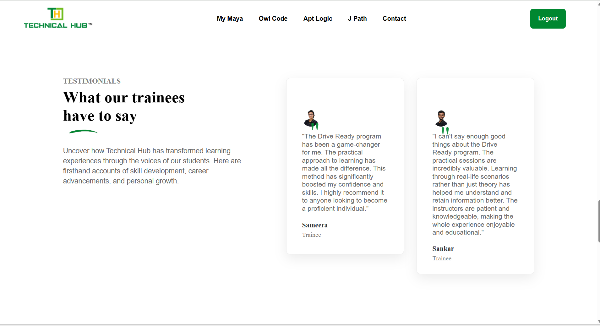

# Maya – Technical Hub (Desktop Replica)

This project is a **desktop-only front-end replica** of the **Maya – Technical Hub** website.  
It has been developed using **pure HTML and CSS** as a practice project to improve layout design, styling, and UI structuring skills.

> ⚠️ **Disclaimer:**  
> This is **not the official Technical Hub or Maya website**.  
> It is a **replica created strictly for educational and learning purposes**.
---

## 📌 Project Overview
The goal of this project is to replicate the **look and feel** of the Maya – Technical Hub desktop website while practicing:
- Modern CSS layouts (Flexbox & Grid)
- Component-based section design
- Positioning and layering using `position`, `z-index`
- Responsive-ready structuring (desktop-focused)
- UI consistency and spacing
---

## 🖥️ Version Information
- **View:** Desktop version only  
- **Responsive:** ❌ Not optimized for mobile/tablet  
- **Purpose:** Learning & practice  

## 🛠️ Technologies Used
- **HTML5**
- **CSS3**
  - Flexbox
  - CSS Grid
  - Positioning & Transforms
  - Gradients & Shadows
- **Font Awesome**
- **Ionicons**
---

## 📂 Sections Included
- Header & Navigation Bar
- Hero Section
- Statistics (Green Section)
- Categories Grid
- About Us Section
- Courses Section
- Testimonials
- Contact Banner
- Get Started Section
- Partners Section
- Footer

---

## 📸 Screenshots
### Home Page





---

## 🚀 How to Run the Project

1. Clone the repository:
   ```bash
   git clone https://github.com/takundagorogodo/maya-technical-hub-website-desktop-version.git
2. Navigate into the project folder:
   cd maya-technical-hub-website-desktop-version
3. Open maya__1.html in your browser.

📚 Learning Outcomes
- Structuring large-scale HTML layouts
- Writing maintainable CSS for complex pages
- Understanding real-world UI cloning
- Improving visual hierarchy and spacing

⚖️ License & Usage
- This project is intended only for educational purposes.
- All design inspiration belongs to Maya – Technical Hub. 
- ❌ Not for commercial use
- ❌ Not affiliated with the official Technical Hub

👤 Author
- GOROGODO TAKUNDA
- Frontend Practice Project
